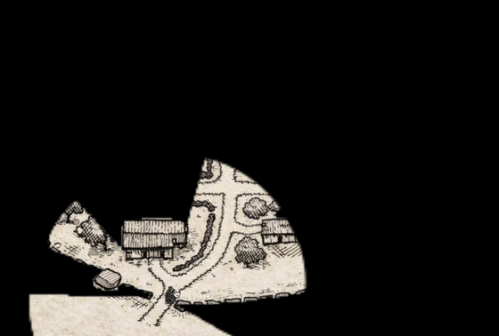
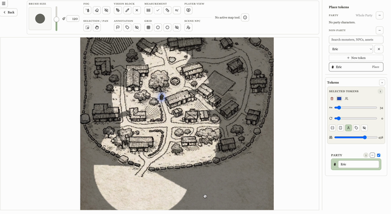
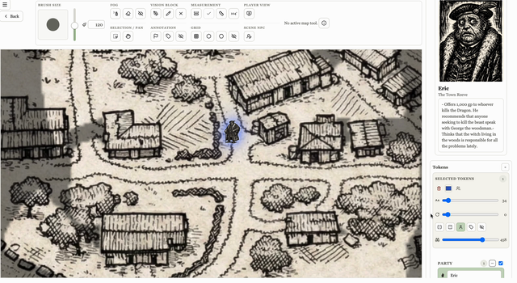
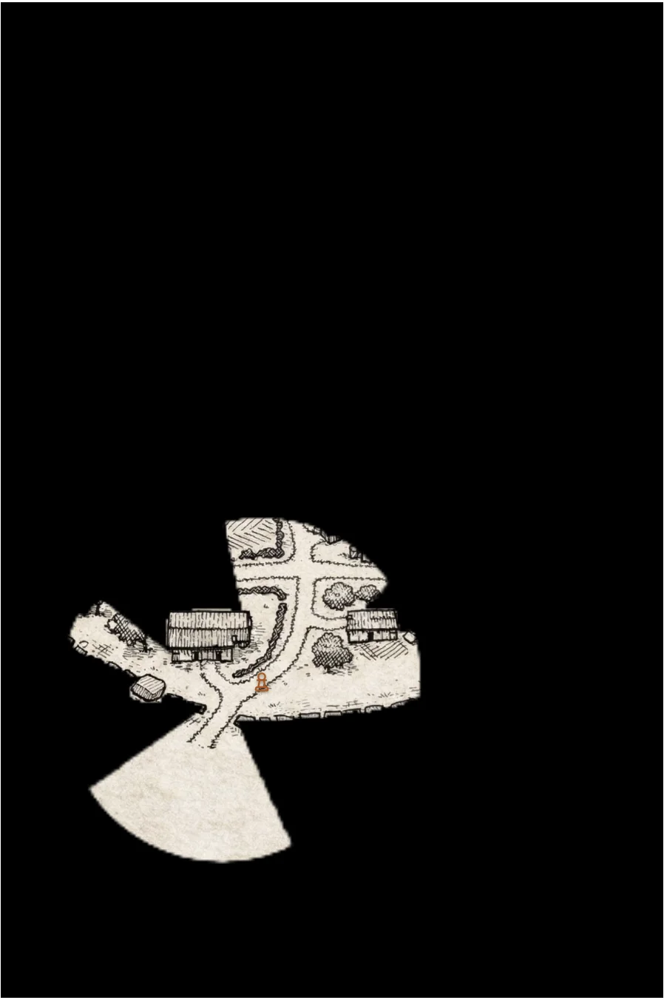
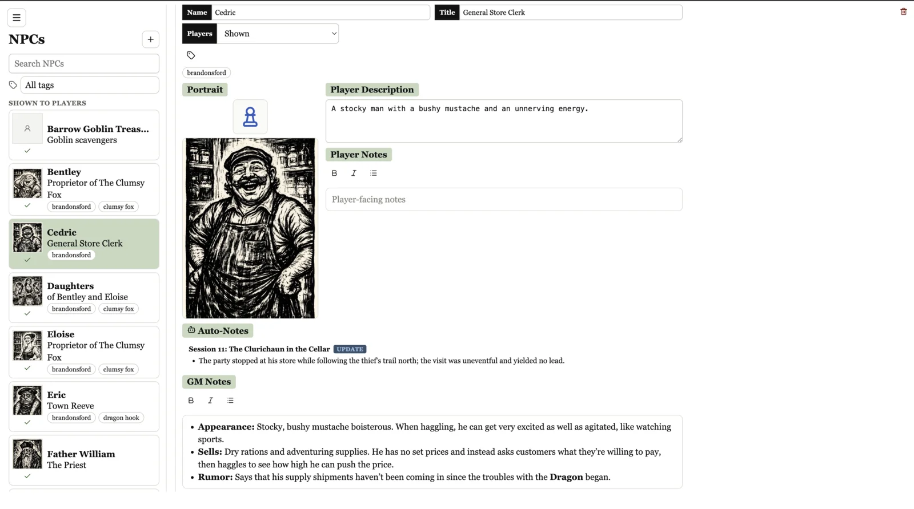
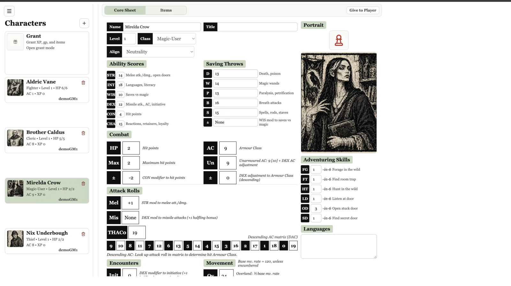

# Table Keep

[](https://github.com/Dbutler2885/TableKeep/actions/workflows/ci.yml)

Table Keep is a virtual tabletop that writes its own campaign log.
Play the session, and the recap and the updated NPC notes are waiting the next time anyone opens the app.

<p align="center">
  
</p>

<p align="center"><em>A player's view of the village, revealed as their token moves. The GM paints the fog; every client sees it change live.</em></p>

## Try it in two minutes

```bash
git clone https://github.com/Dbutler2885/TableKeep.git
cd TableKeep
npm install
npm run demo
```

Then open <http://127.0.0.1:5173> and pick a seat.

No Firebase project.
No account to create.
No API keys, no `.env` file, nothing to sign up for.

`npm run demo` boots the local Firebase emulators from a committed snapshot of a real authored campaign, with its maps, fog, characters, NPCs and items already in place.
It starts the Vite dev server pointed at them.
The sign-in screen offers two seeded seats:

| Seat | Email | Password |
| --- | --- | --- |
| Game Master | `demo-gm@tablekeep.test` | `tablekeep-demo` |
| Player | `demo-player@tablekeep.test` | `tablekeep-demo` |

The startup banner prints the same two lines, so you never have to come back here for them.

The demo seeds more accounts than it offers.
Each character in the campaign belongs to a different player, so the Player seat lands on a real character sheet rather than an empty list, and the rest of the party shows up in the campaign the way it would at a real table.
Those extra accounts are not seats: there is one Game Master button and one Player button, and that is the whole picker.

Sign in as both, in two windows, and look at the same campaign from both sides.
The GM sees every map, every NPC, and every character sheet.
The player sees their own sheet, the part of the map the GM has revealed to them, and only the NPCs and notes the GM has shared.
That gap is the product.

Those accounts exist only inside your own emulator and are not secrets.
**Nothing you do in the demo touches the committed snapshot.**
Visitor mode imports it and never writes it back, so break whatever you like.

Prerequisites: Node.js 24+, npm 11+, and Java 21+ (the Firestore and Storage emulators are JVM processes).
Stop the demo with `Ctrl+C`.

## The demo on the deployed site

The local demo above needs a clone and a JDK.
The deployed site has a lighter door: a **try it now** link on the sign-in screen that hands a visitor a private copy of the same campaign, with no account, no email, and no dialog.

It is not a tour.
A visitor arrives as the **Game Master** of their own copy, with the fog brush, the token layer and the whole tool rail live, because the strongest thing here is painting fog and moving tokens and a read-only version of that is a screenshot.

How it works, in one pass:

- One pristine template campaign lives in the project, seeded from the same `emulator-data/` snapshot the local demo imports, so there is one campaign to author rather than two.
- The link signs the visitor in with Firebase anonymous auth and a Cloud Function copies the template into a fresh group and campaign that belong to that visitor's uid.
- Map images and portraits are **shared, not copied**. A clone keeps every document id, and a map records its image as an absolute Storage path, so every sandbox points at the template's one copy of each image. Only the fog and vision a visitor paints is written, under their own campaign's path.
- Sandboxes last three hours. A scheduled function deletes the documents and the visitor-created objects; a ceiling on how many can exist at once turns a spike into a "the demo is full" message rather than a bill.
- A visitor can read the template and write only their own sandbox. That is enforced in `firestore.rules` and `storage.rules`, not in the interface, and `src/features/demo/demoSandbox.emulator.test.ts` holds it there.

To see it without deploying anything, `npm run demo:sandbox` runs the whole thing on this machine: the emulators including functions, the template seeded from the same snapshot, and the dev server, on a port block of their own so they can sit alongside `npm run demo`.
Open <http://127.0.0.1:5185/demo> and you are in a sandbox.

Turning it on for a project takes three steps beyond a normal deploy: enable Anonymous sign-in in the Firebase console, deploy rules, indexes and functions, and run `npm run demo:seed-template -- --target=project --project=<id> --bucket=<bucket> --apply` once.

## What it is

Table Keep is a virtual tabletop.
The GM reveals a map a piece at a time, and every client sees the fog change as it happens.
Character sheets live in one place and stay current.
The session recaps and the per-session NPC notes write themselves from a recording of the game.

Groups and campaigns hold everything else.

- A user signs in, claims a username, and can belong to multiple groups.
- A group is the stable social container. Members and email invites live there.
- A group holds many campaigns over their lifetime; each campaign owns its own game system and data, and a group has at most one *current* campaign at a time.
  Campaigns move between `draft`, `active`, and `inactive`.
- Each campaign has exactly one GM, its creator.
  Everyone else in the group is a player, and participation is implicit. You are in the campaign because you own a character in it.

Everything lives in Firestore and Firebase Storage under `groups/{groupId}/campaigns/{campaignId}/...`, and everything reads through Firestore listeners.
When the GM erases a patch of fog, moves a token, or publishes an NPC, it is on the players' screens before they look up.
The player UI is mobile-friendly with drawer navigation; the GM UI is desktop-oriented with a left sidebar.

## A guided tour

### Maps, fog, and tokens

<p align="center">
  
</p>

**The map tools, 33 seconds.** The whole GM rail in one pass: brush size, fog, vision blocking, measurement, player view, selection and pan, annotation, grid.
Then the GM drops a token and labels it *The Clumsy Fox*, and the label renders on the board where the table will read it.
[Full-quality recording](.github/media/table-keep-map-tools.mp4).

<p align="center">
  
</p>

**Scene NPCs, 14 seconds.** The GM selects Eric the Town Reeve, and his portrait and notes fill the sidebar.
The GM can read what Eric wants, and what he pays for it, without leaving the map.
It ends on his name label appearing under his token.
Scene NPCs attach to a map from the campaign roster, so the people in a location travel with it.
[Full-quality recording](.github/media/table-keep-scene-npcs.mp4).

Fog is what the rest of the map tooling exists to serve, and it is not a circle of light around a token.
Vision blockers come in two kinds.
Hard walls stop sight dead. Surface walls show you their own face when your sightline touches them.
To work out a reveal, the engine casts between 220 and 1,800 rays out from the token and marches each one pixel by pixel until it hits something.
When a ray lands on a surface wall, a flood fill reveals that contiguous stretch of wall and nothing else, so you see the face you looked at and not the wall standing behind it.

Party tokens carry the vision.
Each has its own view distance, and dragging one streams the fog open along the exact path it travels instead of jumping to the destination.
The GM can flip the whole stage to player view at any time to check what the table can see, and keep dragging while it is on.

Moves replay.
A drag records timestamped waypoints, so every other client replays the move at the pace the GM made it.
A token that crept across the map creeps on everyone's screen.
A party token reveals fog as it goes, so players watch the map open in front of them the way the GM saw it.

Measure the grid, or let the app find it.
Calibrate against a known ten feet and the ruler reads distances off the map in feet.
For hex maps there is a detector that reads the geometry out of the image itself: Sobel edge detection, an orientation histogram scored against the sixty-degree separation a hex grid has to have, autocorrelation for cell spacing, then a mask-fit search over orientation, size and offset with a local refinement pass.
It reports a confidence and pre-fills the grid controls; the GM always confirms.

The tracker counts movement while it happens.
On a calibrated map, party tokens accumulate feet as the GM drags them, and every second hundred-and-twenty-foot turn rolls a d6 for a wandering monster.
It is a B/X check that runs off the moving itself, not off the GM remembering to make it.

And a map does not have to be an uploaded image.
There is a vector editor for sketching one: freehand regions, shapes, fills, marquee select, group drag, copy and paste, undo and redo, and reusable stamps saved per campaign.
It generates its six terrain fills at runtime from a seeded PRNG: trees, grass, dirt, road, water, stone.
It draws every tile at nine wrapped offsets so the edges line up with the next tile, which is why the repository ships no texture assets at all.
The editor flattens a sketched map on save, and from then on it behaves identically to an uploaded one: fog, tokens, grid, line of sight, all of it.

Every one of these changes reaches the other clients as it happens, so a player who joins late or reloads gets the world in the state the GM left it.

<p align="center">
  
</p>

Here is the same village from a player's phone, at the same moment.
Almost all of it is black.
They know there is a road, two buildings, and something south of them. That is all they know.

### NPCs



The NPC roster is split down the middle by who is allowed to see what.
Every record has a portrait, a player-facing description, and private GM notes; the list on the left is grouped by visibility so the GM can see at a glance what the table has met.
Under the portrait, AI writes the Auto-Notes from the session transcript.
Here, Cedric picked up a line from Session 11 about the party passing through his store on the thief's trail.
Nobody typed that.

### Character sheets



The OSE sheet is a real sheet, not a text field with a label.
Ability scores carry their derived modifiers and the sheet breaks saving throws out by category.
The combat block computes AC from armour and DEX, and lays THAC0 out against the full descending AC matrix, so a player reads a to-hit straight off it without doing arithmetic.
Players edit their own character; the GM can edit any of them, and hand one over from the sidebar.

Behind the core sheet is the half of a campaign a table normally keeps on paper and loses by the third session: who is carrying what, who bought what, what got used up, and who handed what to whom.

Inventory is slot-based, and Strength sets the carrying capacity.
Equipped gear does not compete with packed gear for space.
A character carries gold as real coin items at 100 gp to a slot, so money has weight.
Go over capacity and nothing vanishes.
The newest packed items, and any gold that no longer fits, move to Dropped Items as campaign objects tagged with who dropped them, ready to be reorganized and granted back.
The store validates a cart against the character's actual gold before it will sell, and weapon and armour templates know which classes are allowed to use them.

Handing something to another character is a two-sided transfer, not an edit.
The offer carries a snapshot of the item, and accepting it re-validates that snapshot against the sender's live inventory.
If the item has since been sold, changed kind, or dropped in quantity, the transfer fails instead of duplicating it, and it will never push the receiver past their carrying capacity.
Buying, selling, transcribing a spell and re-rolling an ability all reach the GM as approval requests, so the economy has exactly one referee.

## Features

Each campaign picks a game system, and the tab set follows.

*Old-School Essentials* is the deeper of the two: structured sheets, inventory covering weapons, armour, ammunition, consumables and gear, a store and shopping flow, arcane and divine spellbooks, thief skills, a monster catalog, treasure-type generation with magic-item tables, and the OSE SRD link.
The structured data is already there: items, NPCs, monsters, maps, tables, treasure.
It is what automating a lot of play would need, and none of that automation is built yet.
What runs today computes the sheet and polices the economy. It does not run the rules of the game.

*Vampire: The Masquerade* gets a lot of play at the table, and a real slice of it already works: sheets for clan, attributes, abilities, disciplines, backgrounds and virtues, a d10 dice-pool roller with initiative and soak presets, XP priced by category with separate in-clan and out-of-clan discipline costs, clan weaknesses, and generation-based blood pool maximums.
It stops there.
There is no items, store or treasure machinery on the VtM side, and the full ruleset is a future build rather than something already shipped.

Players cannot change the world behind the GM's back.
Item, spell and re-roll requests land in a GM queue with live notifications, and a character-to-character transfer needs a handshake at both ends.

The rest: groups with email invites, per-campaign settings including which tabs are enabled, reusable random tables with entity pickers, shared notes with a rich-text editor, an in-campaign calendar, and session summaries with an importer, a detail view and a cliffhanger highlight modal.
Sign-in is Google or email and password, gated on email verification, with a one-time username claim.

## AI-generated session recaps

The session recaps and the NPC auto-notes above are not typed by hand.
A recording of the session goes in one end and a structured recap comes out the other.
The group plays over Discord, which captures one audio track per speaker.

The pipeline that produces them is a separate macOS service, outside this repository.
This repo owns the receiving end of it: the `postSessionSummary` Cloud Function in [`functions/`](functions/), plus a `getCampaignNpcs` endpoint the pipeline reads first so it can match people it hears about against the campaign's real roster.
Both are shared-secret authenticated HTTP endpoints.

```text
Discord recording (one audio track per speaker)
  -> dropped into a watched folder
  -> split per speaker, resampled to 16 kHz mono
  -> voice-activity detection finds the speech regions in each track
  -> each region transcribed on-device by a Parakeet speech model
  -> regions restamped and merged into one chronological transcript
  -> language model returns a structured session recap
       (summary, scenes, NPC mentions, cliffhangers, in-world calendar)
  -> POST  ->  postSessionSummary  (this repo, functions/)
               matches NPC mentions to the roster, creates stubs for new ones,
               writes the summary into the campaign
```

Transcription runs locally on the machine, with Silero VAD for segmentation and a CoreML Parakeet model behind a small Swift bridge for recognition.
The session audio never leaves the machine.
Only the finished text transcript goes out to a language model, and only the structured recap comes back.

What lands in Table Keep is a normalized object: an overall summary, named scenes with details, NPC mentions with facts, cliffhangers, and calendar entries.
The receiver matches each NPC mention case-insensitively against the campaign roster, links unambiguous matches to the existing record, creates a stub for anyone new, and files the whole thing as a session summary with `api` source markers so a human editing it later is distinguishable from the generator.
That is why Cedric's card, in the screenshot above, knows about a store visit in Session 11.

## How it is built and tested

The stack is Vite, React 19 and TypeScript, with React Router and Konva for the map canvas.
Firebase Authentication, Cloud Firestore, Storage, Cloud Functions (2nd gen), Hosting.
Iconify (game-icons) and lucide-react for iconography.
Vitest for tests, ESLint for linting.

### Continuous integration

Every pull request, and every push to `main`, runs [`.github/workflows/ci.yml`](.github/workflows/ci.yml).
The workflow only ever reads the repository, holds no secrets, and deploys nothing.
It runs seven jobs in parallel, each one a command you can reproduce locally:

| Check | Command |
| --- | --- |
| Lint (web app) | `npm run lint` |
| Typecheck (web app) | `npm run typecheck` |
| Unit tests (web app) | `npm test` |
| Production build (web app) | `npm run build` |
| Emulator tests (Firestore + Storage rules) | `npm run test:emulator` |
| Browser smoke (desktop + mobile) | `npm run test:browser-smoke` |
| Cloud Functions (lint + build) | `npm run lint` and `npm run build` in `functions/` |

The web app jobs run on Node 24, matching the prerequisites above.
The Cloud Functions job runs on Node 20, matching `engines.node` in `functions/package.json` and the deployed function runtime.
The split is deliberate.

### Test layers

- **Unit** (`npm test`). Vitest covers the pure logic: spell catalogs and spellbook rules, inventory synchronization, VtM creation, roll and XP rules, item-transfer resolution, and the map tool-state and token-placement machines.
- **Component** (`npm test`). The `.test.tsx` suites opt into a jsdom environment per file with a docblock, so the rest of the run stays in Node. The sign-in screen's seat picker is covered here.
- **Rules** (`npm run test:emulator`). Every `src/**/*.emulator.test.ts` runs against a live Firestore and Storage emulator with the repository's real `firestore.rules` and `storage.rules` loaded, so the suite exercises authorization as deployed, not as intended.
  The demo sandbox lives or dies here: one suite proves a visitor can read the template and not write it, can reach only their own sandbox, and cannot touch another visitor's or any real user's data; another drives the real clone and expiry code against the emulator.
  Needs JDK 21+.
- **Browser smoke** (`npm run test:browser-smoke`). Puppeteer against local services only.
  It starts Vite inside `firebase emulators:exec`, creates isolated emulator users, completes email verification through the emulator's OOB API, claims a handle, and creates a group at both desktop and mobile viewports.
  It fails on page errors and console errors, and uploads review-only screenshots even when the run fails.

### Project layout

- `src/features/*` holds the feature modules: auth, groups, campaign, character (OSE and VtM), maps, monsters, items, treasure, npcs, tables, notes, transfers, tokens, navigation, common.
- `src/firebase/*` sets up the Firebase SDK and wires the emulators.
- `functions/` holds the Cloud Functions source: session-summary ingestion, NPC roster lookup, the item-transfer callable, the demo-sandbox callable and its expiry schedule, and a health check.
- `scripts/demo/` is the demo harness and its snapshot tooling.
- `emulator-data/` is the committed snapshot the demo boots from. `npm run demo:size` checks it against a budget of 25 MB total and 1 MB per file.
- `demoSessions/{uid}` is the registry of live demo sandboxes: one row per anonymous visitor, and the only thing the expiry sweep reads.
- Firebase config lives in `firebase.json`, `.firebaserc`, `firestore.rules`, `firestore.indexes.json` and `storage.rules`.

### Firestore data model

- `users/{userId}` holds platform identity: email, username, timestamps.
- `groups/{groupId}` is the group, with `members/{userId}`, `invites/{inviteId}` and `campaigns/{campaignId}` subcollections.
- `groups/{groupId}/campaigns/{campaignId}/...` holds the per-campaign data: `characters`, `npcs`, `maps` (each with `tokens` and `annotations`), `items`, `tables`, `sessionSummaries`, and per-user UI scratch under `userState/{userId}`.

## Scripts

| Script | What it does |
| --- | --- |
| `npm run dev` | Vite dev server |
| `npm run build` | Type-check and production build |
| `npm run typecheck` | `tsc -b`, no bundle |
| `npm run lint` | ESLint |
| `npm test` | Unit tests |
| `npm run test:watch` | Unit tests in watch mode |
| `npm run test:emulator` | Firestore/Storage rules tests against live emulators |
| `npm run test:browser-smoke` | Desktop + mobile Puppeteer smoke flow |
| `npm run preview` | Preview the production build |
| `npm run demo` | Visitor demo: emulators from the committed snapshot plus the dev server, snapshot never written |
| `npm run demo:author` | Authoring demo: the same, but exports back to `./emulator-data` on exit. The only command that overwrites the committed snapshot |
| `npm run demo:save` | Export a running demo emulator without quitting it |
| `npm run demo:seed` | Re-seed the demo accounts into a running demo emulator |
| `npm run demo:seed-template` | Dry-run seeding the hosted demo's template campaign from the snapshot. Add `-- --apply` to write |
| `npm run demo:sandbox` | The hosted try-it-now demo, run entirely locally: emulators (including functions), the seeded template, and the dev server |
| `npm run demo:size` | Check `./emulator-data` against its commit budget |
| `npm run emulators` | Start the auth/firestore/storage emulators bare |
| `npm run emulators:import` | Start emulators with persisted state |
| `npm run emulators:export` | Export emulator state |
| `npm run deploy:hosting` | Deploy hosting |
| `npm run deploy:functions` | Deploy Cloud Functions |
| `npm run firebase:login` | Log in to the Firebase CLI |

Data-import helpers for OSE reference content also exist as `npm run ose:*`; see `package.json` and `scripts/`.

## Running against a real Firebase project

The demo needs none of this.
It is here for anyone who wants to deploy their own instance.

```bash
npm run firebase:login
npx firebase projects:create your-project-id     # or skip, and use an existing one
npx firebase use --add                           # select it, alias it "default"
npx firebase firestore:databases:create --location=us-central
npx firebase deploy --only firestore:rules,firestore:indexes,storage
```

Then copy `.env.example` to `.env.local` and fill in the `VITE_FIREBASE_*` values from the project's web app config.
Set `VITE_USE_FIREBASE_EMULATORS=true` to point a normal `npm run dev` at local emulators instead.

Auth provider toggles (Google, email/password) still have to be enabled in the Firebase console; there is no CLI for them.

> `.env.example` still lists `VITE_GM_EMAILS`.
> GM assignment moved to a per-campaign owner (`gmUserId`) some time ago, so that variable is legacy and is not read anywhere in the app.
